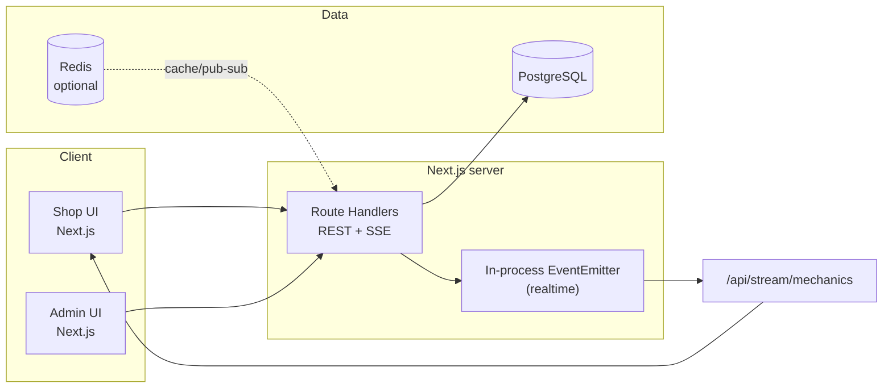

# Mechanic Shop Management — Architecture

This repository implements the **Gear Up** mechanic shop platform as a **single Next.js 16** app (App Router) with **PostgreSQL** via **Prisma 5**, optional **Redis** for future caching/pub-sub, and **Server-Sent Events (SSE)** for live mechanic tiles on a single Node instance.

## 1. System design

### Logical layers

| Layer | Responsibility |
| --- | --- |
| **Shop UI** (`/shop/*`) | Live bay board (SSE), parts shelf with preorder, guided booking. |
| **Admin UI** (`/admin/*`) | Parts, services, mechanics, shop hours, bookings list. Protected writes use `Authorization: Bearer <ADMIN_API_KEY>`. |
| **API routes** (`src/app/api/*`) | REST endpoints + SSE stream. Stateless handlers call shared libs (`lib/`). |
| **Domain services** (`src/lib/*`) | Slot generation, booking + inventory transaction, preorder helper. |
| **Database** | PostgreSQL — Prisma schema maps entities and relations. |

### Architecture diagram



**Scaling note:** SSE + `EventEmitter` works on **one** Node process. For horizontal scale, replace the emitter with **Redis pub/sub** (or NATS) so API instances publish “mechanics changed” and each Node forwards to its own SSE/WebSocket connections.

### Real-time choice

- **Shipped:** SSE (`GET /api/stream/mechanics`) — browser `EventSource`, works through many proxies, simpler ops than sticky sessions for WebSockets.
- **Upgrade path:** Socket.IO or native WebSockets + Redis adapter for fan-out across instances.

---

## 2. Database schema (Prisma)

Defined in `prisma/schema.prisma`. Core tables:

| Table | Purpose |
| --- | --- |
| `User` | Customers (upserted by email at booking/preorder time). |
| `Mechanic` | Staff roster; `status` supports manual override merged with live occupancy. |
| `Service` | Name, `durationMinutes`, `priceCents` — duration drives slot blocking. |
| `Part` | Catalog row + `stockQuantity` + `restockLeadDays` for ETA copy when empty. |
| `ShopSettings` | Singleton row (`id = default`): open/close, slot step. |
| `TimeSlotRule` | Optional per-weekday overrides (starter scaffold — generator uses `ShopSettings` today). |
| `Booking` | Confirmed appointment window `[startAt, endAt)` tied to `mechanicId`. |
| `BookingPartLine` | Sold parts on a service booking; triggers ledger + stock decrement. |
| `PartPreorder` | Out-of-stock reservations with `expectedBy`. |
| `InventoryLedger` | Audit trail for stock deltas. |

**Overlap prevention:** Booking creation runs under **`Serializable`** isolation and assigns the first mechanic (ordered by id) with no overlapping rows for `[startAt,endAt)`. PostgreSQL can additionally enforce non-overlap later via **exclusion constraints** (`tstzrange`) + `btree_gist`.

---

## 3. API endpoints

| Method | Path | Auth | Notes |
| --- | --- | --- | --- |
| GET | `/api/mechanics` | Public | Live-derived mechanic tiles (busy vs free). |
| POST | `/api/mechanics` | Admin | Create mechanic; broadcasts refresh. |
| PATCH | `/api/mechanics/[id]` | Admin | Rename / toggle stored status. |
| GET | `/api/stream/mechanics` | Public | SSE stream of `{ mechanics }`. |
| GET | `/api/parts` | Public | Parts catalog. |
| POST | `/api/parts` | Admin | Create part. |
| PATCH/DELETE | `/api/parts/[id]` | Admin | Update/delete. |
| GET | `/api/services` | Public | Active services only. |
| GET | `/api/services?all=1` | Admin | Includes inactive. |
| POST | `/api/services` | Admin | Create service. |
| PATCH | `/api/services/[id]` | Admin | Update service. |
| GET | `/api/shop/settings` | Public | Upserts default shop row if missing. |
| PUT | `/api/shop/settings` | Admin | Persist hours + slot step. |
| GET | `/api/slots?serviceId=&from=&days=` | Public | Computes offerable slots (deterministic mechanic choice). |
| GET | `/api/bookings` | Admin | Recent bookings + joins. |
| POST | `/api/bookings` | Public | Creates booking + optional in-stock parts. |
| POST | `/api/preorders` | Public | Preorder when off shelf. |

Environment variables (see `.env.example`):

- `DATABASE_URL` — PostgreSQL connection string.
- `ADMIN_API_KEY` — Bearer token for admin mutations.

---

## 4. Performance & scaling (1000+ concurrent users)

| Concern | Approach |
| --- | --- |
| **Hot booking path** | Short DB transaction, indexed lookups on `(mechanicId, startAt)` and time range filters. No long locks on read-only slot preview. |
| **Slot API** | Compute on demand; cache per `(serviceId,day)` in **Redis** with short TTL (30–60s) to protect DB under flash traffic. |
| **Race on last slot** | `Serializable` transaction + unique logical guard; add DB exclusion constraint for belt-and-suspenders. |
| **Live board** | Edge fan-out: move from in-process events to **Redis pub/sub**; use **connection limits** and **heartbeat** on SSE. |
| **Read replicas** | Route `GET` slot/history queries to replica; keep writes on primary. |
| **Front-end** | Next.js static + edge cache for marketing; API dynamic. Target **p95 < 300ms** on booking POST with warm DB pool (`PgBouncer`). |

---

## 5. UI / UX flows

### Customer

1. Opens `/shop` → sees **live mechanic floor** via SSE.
2. `/shop/parts` → in-stock counts or preorder CTA with ETA based on `restockLeadDays`.
3. `/shop/book` → selects service → loads computed slots (rolls to next day automatically when today is full or closed) → optionally attaches parts with inventory checks → confirms booking.

### Admin

1. Sets **`ADMIN_API_KEY`** server-side; pastes same key into Admin banner (sessionStorage).
2. Adds/edits **parts**, **services**, **shop hours**, **mechanics**.
3. Reviews **bookings** table for dispatch.

---

## 6. Local setup

```bash
cp .env.example .env
# Set DATABASE_URL and ADMIN_API_KEY

npm install
npx prisma generate
npx prisma db push
npm run db:seed   # optional demo data

npm run dev
```

Open `http://localhost:3000` — choose **Shop front** or **Admin**.

---

## 7. Starter implementation map

| Area | Location |
| --- | --- |
| Slot generator | `src/lib/slots.ts`, `src/lib/time-helpers.ts` |
| Booking + inventory | `src/lib/booking-service.ts` |
| Live mechanic projection | `src/lib/mechanics-live.ts` |
| SSE | `src/app/api/stream/mechanics/route.ts` + `src/lib/realtime.ts` |
| Shop UI | `src/app/shop/*`, `src/components/LiveMechanicsBoard.tsx` |
| Admin UI | `src/app/admin/*`, `src/components/AdminGate.tsx` |

This is intentionally **lean**: swap SSE→Socket.IO+Redis when you add a second API instance, add **full auth** (e.g. NextAuth) when pilots demand accounts, and tighten inventory with **warehouse bins** when ops complexity grows.
